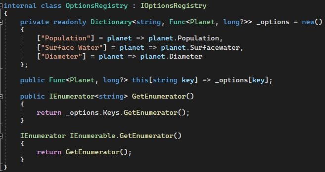
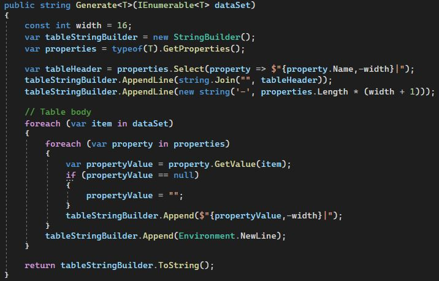
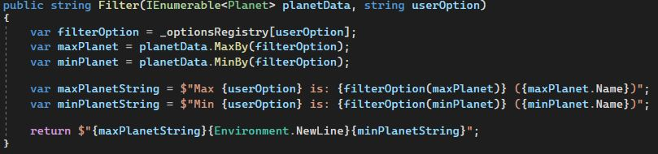
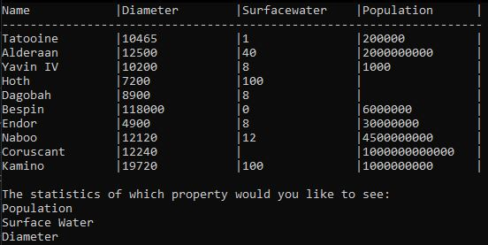
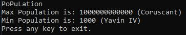
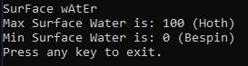
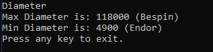

# StarWarsPlanets
This C# console application gathers information about planets in the star wars universe through the use of an API (The Star Wars API) and, based on user input, displays the planet that has the highest population, surface water coverage or diameter as well as the planet that has the lowest.  
The main purpose of this project was to familiarize myself with the use of records, structs and record structs in C#, as well as further practice with my overall coding and organizational skills. For this project I decided to practice the strategy design pattern when it came to which option was selected to filter the data by.  
 

Everything was pretty straight forward at first, communicate with the API to retrieve the json for the planets, convert that into the data I could work with, and display that data. I could have just created a method that took a list of planets (List<Planet>), but that wouldn't have been any fun and one of the aims was to practice the use of reflection. With the Generate<T> method I did exactly that, the method will grab all the properties from a data set passed through it and, with the use of reflection and StringBuilder, the table will be created with the size of the table being dynamic.  

  

Looking back now, it would have been more efficient memorywise to have just printed the lines one by one rather than construct a giant string and then write that to the console as this could potentially consume a lot of memory on the stack if this were a large scale display.  
The screenshots below show the table display and then the results when a user types in one of the options. You will notice that for the options where population and surface water were selected, the capitilzation for these words are randomized. This was done intentionally to test cases where the user may have mistakenly capitalized letters by accident, as the string would be used to retrieve the filter that the Filter method would use which was essentially the concrete strategy to be applied in the algorithm. This is where most of the fun was had, in the Filter method. I spent what felt like eternity trying to write out the algorithm to retrieve the objects that contained the max and min valuse of the lambda expression that was selected as the filter. The breakthrough being the discovery of a LINQ extension method that does that for you. Nevertheless it was a fun journey.  

 

